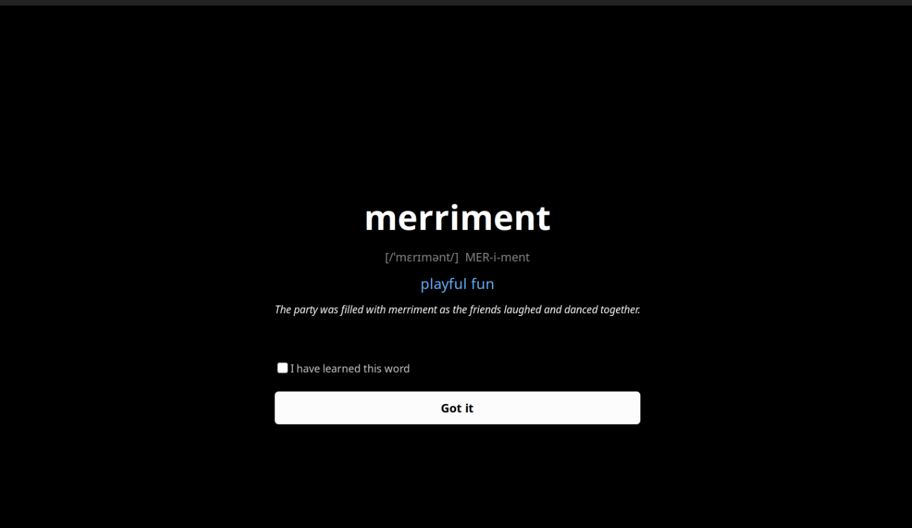

# VocaBlock

> The vocabulary flashcard system that refuses to let you forget words.

## Project Overview

VocaBlock is a personal vocabulary learning tool I built after spending way too long looking up the same word for the fifth time while reading *Crime and Punishment* by Fyodor Dostoevsky.

The idea is simple: every time you encounter a difficult word while reading, you jot it down in an Obsidian note. VocaBlock then takes over from there — it quietly picks a few words each day, catches you at random moments with fullscreen popups, and quizzes you on the ones you've already learned. Over time, the hard words stop being hard.


## How It Works

Every morning, VocaBlock sets up a schedule of 10 events throughout the day — 5 word popups and 5 quiz popups, spread between 8 AM and 10 PM with at least 90 minutes between each one. Here's the full flow:

```
┌─────────────────────────────┐
│  Obsidian note saved        │
│  (data/Crime_Punishment.md) │
└────────────┬────────────────┘
             │
             ▼
┌─────────────────────────────┐
│  sync_watcher.py           │  ← watchdog monitors the file
│  Detects change → runs      │     for edits, triggers parser
│  parser logic inline        │     automatically
└────────────┬────────────────┘
             │
             ▼
┌─────────────────────────────┐
│  parser.py                  │  ← parses the markdown table,
│  Extracts words + meanings  │     inserts into SQLite
│  from table format          │
└────────────┬────────────────┘
             │
             ▼
┌─────────────────────────────┐
│  ai_gen.py                  │  ← calls Groq API (llama-3.1-8b)
│  For each new word:         │     generates IPA, hint, and
│  generates IPA + hint +      │     example sentence, caches
│  example sentence           │     in ai_cache table
└────────────┬────────────────┘
             │
             ▼
┌─────────────────────────────┐
│  scheduler.py               │  ← runs as a background daemon
│  Every morning:             │     schedules 10 events spread
│  picks 5 words + creates    │     across the day
│  today's session            │
└────────────┬────────────────┘
             │
             ▼
┌─────────────────────────────┐
│  new_word_popup.py          │  ← GTK3 fullscreen popup,
│  5× per day, random times   │     shows word, IPA, meaning,
│  between 8am–10pm           │     sentence. User checks box,
│                             │     clicks "Got it" → progress
│                             │     updated in database
└────────────┬────────────────┘
             │
             ▼
┌─────────────────────────────┐
│  quiz_popup.py              │  ← GTK3 quiz popup, picks a
│  5× per day, random times   │     confirmed word, shows 4
│  between 8am–10pm           │     multiple-choice options.
│                             │     Correct → green. Wrong →
│                             │     correct answer highlighted.
│                             │     Auto-closes after 2.5s
└─────────────────────────────┘
```

The system autostarts via a GNOME desktop entry file on login.

## In Action
### New Word Popup


### Quiz Popup


## Features

- **Automatic word sync** — save words in Obsidian markdown table format, and the watcher picks them up instantly
- **AI-generated learning cards** — each word gets IPA pronunciation, a syllable-by-syllable hint, and an example sentence from the Groq API
- **Spaced repetition scheduling** — scheduler picks words prioritizing those never shown, then those never confirmed, then the oldest
- **5 daily word popups** — fullscreen GTK3 popup, shows word + meaning + sentence, requires checkbox confirmation
- **5 daily quiz popups** — multiple choice quiz drawn from confirmed words, immediate feedback, auto-closes after correct answer
- **Daily session persistence** — the same 5 words stay for the whole day, pointer tracks which one you're on
- **Auto-start on login** — `vocablock.desktop` autostart entry launches everything via `start_vocablock.sh`
- **Background daemon** — `schedule_popups.py` runs indefinitely, checking every 60 seconds for events to launch
- **File watcher** — `sync_watcher.py` runs in the background, re-parses on any save
- **Separate watcher** — `watcher.py` is a standalone alternative that triggers `parser.py` via subprocess

## Tech Stack

- **Python 3.10+** — all scripts are plain Python
- **GTK3** — fullscreen popup windows for word display and quizzes
- **SQLite** — `data/vocab.db` stores all words, AI cache, sessions, progress, and scheduled events
- **Groq API** — llama-3.1-8b-instant model for generating IPA, hints, and sentences
- **watchdog** — file system observer for auto-parsing on Obsidian save
- **systemd / GNOME autostart** — `~/.config/autostart/vocablock.desktop` launches the startup script on login
- **uv** — package and venv manager

## Project Structure

```
vocablock/
├── scripts/
│   ├── parser.py          Parses markdown table, inserts words into SQLite
│   ├── ai_gen.py          Calls Groq API, stores IPA/hint/sentence in ai_cache
│   ├── scheduler.py       Selects 5 words per day, creates sessions in DB
│   ├── schedule_popups.py  Background daemon — schedules 10 events/day, launches popups
│   ├── sync_watcher.py    watchdog-based file monitor with inline parser logic
│   ├── watcher.py         Standalone watcher that calls parser.py as subprocess
│   ├── new_word_popup.py   GTK3 fullscreen word display popup
│   ├── quiz_popup.py       GTK3 multiple-choice quiz popup
│   └── start_vocablock.sh  Boot script: runs parser, ai_gen, then starts watchers/scheduler
├── data/
│   ├── vocab.db            SQLite database
│   ├── Crime_Punishment.md Sample Obsidian vocabulary file
│   ├── scheduler.log       Log file from schedule_popups.py
│   └── .obsidian/          Minimal Obsidian config (workspace.json)
├── .env                    Contains GROQ_API_KEY (not committed to git)
├── vocablock.desktop       GNOME autostart desktop entry
└── README.md
```

## Prerequisites

- **Ubuntu or Linux with GNOME** — the autostart and GTK3 parts are Linux-specific
- **Python 3.10 or higher**
- **uv** — install with `curl -LsSf https://astral.sh/uv/install.sh | sh`
- **GTK3 system packages** — `python3-gi` and `gir1.2-gtk-3.0`
- **PAM development** — `python3-pam` (if you ever want to add a PAM unlock gate)
- **Gemini API key** — sign up at https://aistudio.google.com/apikey (note: the current code uses Groq, not Gemini)

## Installation & Setup

```bash
# 1. Clone the repo
git clone https://github.com/MadihaFarman/VocabLock.git
cd vocablock

# 2. Install system dependencies (Ubuntu/Debian)
sudo apt install python3-gi gir1.2-gtk-3.0 python3-pam

# 3. Create virtual environment with uv
uv venv
source .venv/bin/activate

# 4. Install Python packages
uv pip install requests python-dotenv watchdog

# 5. Create .env file with your Groq API key (or Gemini API key)
#    Sign up at https://console.groq.com/ to get a free API key
echo 'GROQ_API_KEY="your-key-here"' > .env

# 6. Create the database (run the parser once)
python scripts/parser.py

# 7. Generate AI cards for existing words
python scripts/ai_gen.py

# 8. Set up GNOME autostart
cp vocablock.desktop ~/.config/autostart/
# Or manually create ~/.config/autostart/vocablock.desktop with:
#   [Desktop Entry]
#   Type=Application
#   Name=VocaBlock
#   Exec=bash /path/to/vocablock/scripts/start_vocablock.sh
#   X-GNOME-Autostart-enabled=true

# 9. Reboot or run manually to test
bash scripts/start_vocablock.sh
```

## Usage

**Adding a new word:** Open `data/Crime_Punishment.md` in Obsidian (or any text editor) and add a row to the table in this format:

```
| word      | definition                            |
| --------- | ------------------------------------- |
| loquacious | excessively talkative                 |
```

The watcher will detect the save within a second or two and automatically parse the new word into the database.

**How the auto-sync works:** `sync_watcher.py` uses the `watchdog` library to monitor `data/Crime_Punishment.md`. Whenever the file changes, it re-runs the parser logic inline — no subprocess needed. New words get inserted into the `words` table and a progress row is created for each one.

**Testing popups manually:**

```bash
# Test word popup
python scripts/new_word_popup.py

# Test quiz popup
python scripts/quiz_popup.py

# Re-generate AI data for all words
python scripts/ai_gen.py

# Re-run parser on the Obsidian file
python scripts/parser.py
```

## Database Schema

The database has 6 tables:

**words** — the core vocabulary list
- `id` — auto-increment primary key
- `word` — the vocabulary word, unique (stored lowercase)
- `meaning` — your definition of the word
- `source` — defaults to "Crime & Punishment", can be changed per word
- `date_added` — ISO date when the word was first parsed

**ai_cache** — AI-generated learning data per word
- `word_id` — references `words.id`, primary key
- `ipa` — International Phonetic Alphabet pronunciation
- `hint` — syllable breakdown in plain English (e.g., "pur-spi-KAY-shus")
- `sentence` — example sentence using the word
- `generated_on` — when the AI call was made

**sessions** — daily word sessions
- `date` — ISO date, primary key (one session per day)
- `word_ids` — JSON array of word IDs selected for that day (e.g., `[3, 17, 8, 22, 41]`)

**progress** — learning stats per word
- `word_id` — references `words.id`, primary key
- `times_shown` — how many times the word popup has been shown
- `times_confirmed` — how many times the user clicked "Got it" on this word
- `quiz_correct` — correct quiz answers for this word
- `quiz_total` — total quiz attempts for this word
- `last_shown` — ISO date of last popup display
- `last_quizzed` — ISO date of last quiz attempt

**current_pointer** — tracks position in today's session
- `date` — ISO date, primary key
- `pointer` — which word in the session you're currently on (0-based)

**scheduled_events** — upcoming popup schedule
- `date` — ISO date
- `event_type` — either `'word'` or `'quiz'`
- `scheduled_time` — ISO datetime string
- `launched` — 0 = pending, 1 = launched
- Primary key is `(date, event_type, scheduled_time)`

## Roadmap

- **Android app** — the plan is to eventually build a companion Android app so I can do word popups and quizzes on my phone too. The daily session would sync from the same SQLite database. No ETA, but it's on the list.

## Acknowledgements

Fyodor Dostoevsky, for writing a book so dense that it made me build an entire vocabulary learning system just to survive reading it.If you want to see what this project started from, check out `data/Crime_Punishment.md` — it's a real Obsidian note I kept while reading.

